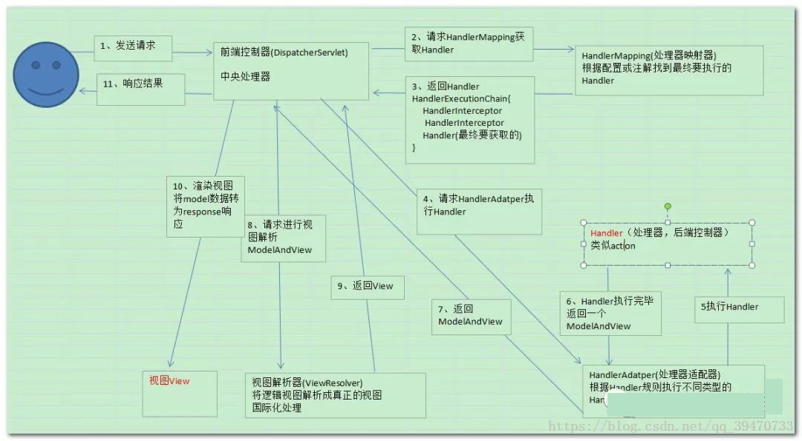

# MySpringMVC
通过一个网易云课堂，尝试自己来手写一个自己的SpringMVC，理解SpringMVC框架原理，本质底层就是一个Servlet。通过一系列手段，控制反转，映射，反射，注解等方法。完成一个看起来高端大气上档次的框架。
### SpringMVC框架工作流程图

### 基本原理与简单实现
1. 继承Servlet，并且实现下面步骤
1. 加载配置文件，读取配置信息，Controller的包位置等。
1. 从Controller包位置，读取Controller类的信息
1. 从上一步的信息利用 `Class.forName()`加载Controller成为Java实例
1. 利用注解将url与method和class object对应起来，方便访问的时候查找
1. 找到后利用反射来完成方法入参及调用实现
### 个人理解
* 注解的作用基本上就是为了起一个标识的作用，用来区分不同的作用
### 参考
* [参考博客地址](https://my.oschina.net/liughDevelop/blog/1622646)
* [SpringMVC框架工作流程图及工作原理](https://blog.csdn.net/qq_39470733/article/details/80980320)